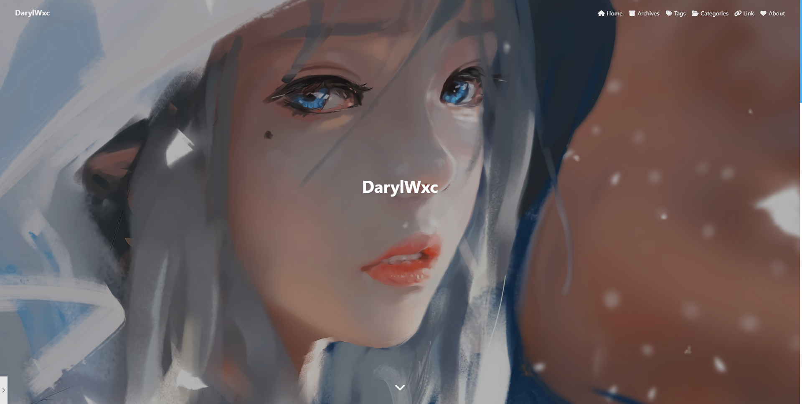
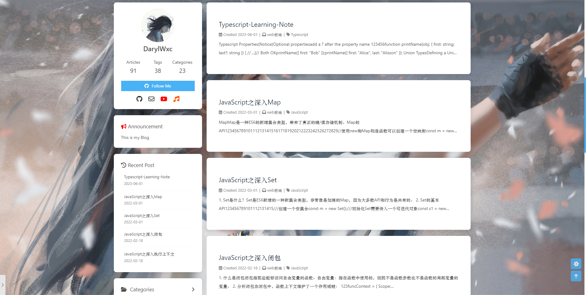
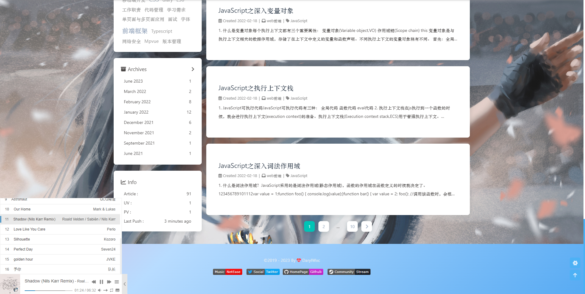

# DarylWxc

> A Personal Blog

## 🎉 Welcome to My personal Blog

1. You can have a look about my posts😀

2. This is my personal career👣

3. I'm a web developer🦸

4. I develop the program with JavaScript💡

5. Come on then!😆

## ⚙ Hexo

[Hexo Official website](https://hexo.io/zh-cn/)🎯

***My blog is base on the Hexo framework,you can started it fast,just click the link above!!***

## ✨ Use Butterfly Themes

[ButterFly Theme](https://butterfly.js.org/)🦋

***I use the Butterfly Themes,you can also take the same with me,it is a great theme,link above there***

## 📷 Screenshots

